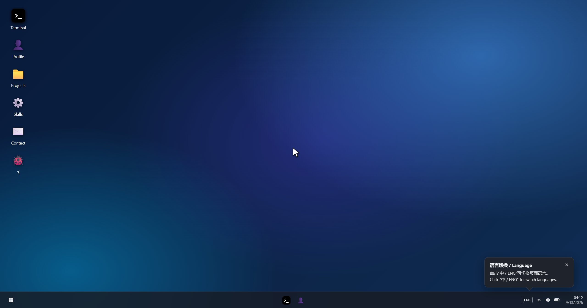

# Fang OS — Windows-Style Personal Homepage

Fang OS is an interactive personal homepage presented as a fictional Windows-style operating system. It is not a real operating system or command-line environment—the desktop and simulated terminal provide a familiar, playful way to explore a personal portfolio.

### [Open the Live Demo →](https://fang520huang-lgtm.github.io/Personal-Homepage/)

[](https://fang520huang-lgtm.github.io/Personal-Homepage/)

[Full English walkthrough](assets/demo/personal-homepage-full-demo.mp4) · [Language-switch walkthrough](assets/demo/personal-homepage-language-switch-demo.mp4)

## What This Homepage Presents

- **Profile** — name, academic or professional role, location, and a short personal introduction
- **Technical skills** — programming languages, tools, development interests, and practical capabilities
- **Projects** — selected work with concise descriptions, technology stacks, repository links, and live demonstrations where available
- **Contact details** — email, WeChat, and GitHub profile

The same information can be explored through desktop application windows or commands in the simulated terminal.

## Core Features

- A fictional Windows-inspired interface with a boot sequence, lock screen, desktop, Start menu, taskbar, and application windows
- Dedicated portfolio applications for the profile, skills, projects, and contact details
- A simulated terminal with commands such as `about`, `projects`, `skills`, and `contact`
- Familiar desktop interactions, including movable icons and draggable, resizable, minimizable, and maximizable windows
- English and Chinese interfaces, switched from the input-method indicator in the lower-right corner
- A fully static implementation built with plain HTML, CSS, and JavaScript, with no runtime dependencies or build step
- Small interactive details and easter eggs that make the portfolio feel like a complete fictional desktop environment

## Run Locally

No installation or build process is required.

1. Clone or download the repository.
2. Open `index.html` in Chrome or Edge.

You can also serve the directory with any static web server, such as the Live Server extension for Visual Studio Code.

## Customize the Portfolio

Edit the `USER` object near the top of `js/app.js`. It is the single source of truth for:

- Chinese and English profile text
- Contact details and GitHub links
- Skill tags and capability descriptions
- Project names, summaries, technology stacks, and links

The desktop applications and terminal both read from this data, so portfolio content stays synchronized throughout the interface.

## Project Structure

```text
.
├── .github/
│   └── workflows/pages.yml
├── assets/
│   ├── avatar.jpg
│   └── demo/
│       ├── personal-homepage-full-demo.mp4
│       ├── personal-homepage-language-switch-demo.mp4
│       ├── personal-homepage-desktop.png
│       ├── personal-homepage-terminal-demo.gif
│       ├── personal-homepage-terminal-demo.mp4
│       └── personal-homepage-terminal-demo.png
├── css/
│   └── style.css
├── js/
│   ├── app.js
│   └── terminal.js
├── index.html
├── LICENSE
└── README.md
```

## Browser Support

The latest versions of Chrome and Edge are recommended. Browser security rules may prevent a webpage from closing its own tab; in that case, Fang OS remains on the shutdown screen.

## License

Released under the [MIT License](LICENSE).

---

## 中文说明

Fang OS 是一个伪装成 Windows 风格虚拟系统的个人主页。它不是真正的操作系统或命令行工具，而是借助开机、锁屏、桌面、任务栏、应用窗口和模拟终端，为个人介绍提供更有趣的展示方式。

### [打开在线演示 →](https://fang520huang-lgtm.github.io/Personal-Homepage/)

[完整英文演示](assets/demo/personal-homepage-full-demo.mp4) · [中途切换中文演示](assets/demo/personal-homepage-language-switch-demo.mp4)

主页主要展示以下个人内容：

- **个人简介**：姓名、学习或工作身份、所在地与个人介绍
- **技术技能**：编程语言、开发工具、技术方向与实践能力
- **项目经历**：项目简介、技术栈、GitHub 仓库和可用的在线展示
- **联系方式**：邮箱、微信和 GitHub 主页

访客既可以打开桌面上的应用查看这些内容，也可以在模拟终端中输入 `about`、`projects`、`skills`、`contact` 等命令进行浏览。右下角的输入法图标可用于切换中文和英文界面。

项目使用原生 HTML、CSS 和 JavaScript 编写，无需安装依赖或执行构建命令。需要替换个人资料时，只需编辑 `js/app.js` 顶部的 `USER` 对象，桌面应用和终端内容会自动保持一致。
